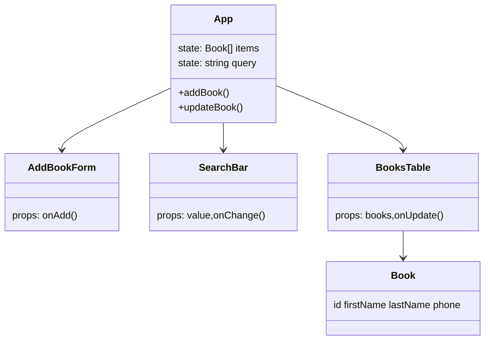

# Address Book

Minimal React + TypeScript address book with inline editing, validation, search and local persistence.

## Features
- Add contact: required fields (first name, last name, phone) with messages:
  - The first name is required
  - The last name is required
  - The phone is required
- Inline row editing (cannot save empty fields)
- Search (first / last / phone, case-insensitive)
- Empty state: `No data to display.`
- Data persisted in `localStorage`
- Stable generated `id`

## Data Model
```
Book {
  id: string
  firstName: string
  lastName: string
  phone: string
}
```

## Architecture (overview)



## Patterns
- Lifting State Up (all core state in `App`)
- Controlled Inputs (form, search, edit)
- Inline Editing
- Validation (required fields)
- Conditional Rendering (empty state)
- Immutability (array updates via `map`)
- Persistence (localStorage)

## Scripts
| Command | Purpose |
|---------|---------|
| `npm run dev` | Dev server |
| `npm run build` | Production build |
| `npm run preview` | Preview build |

