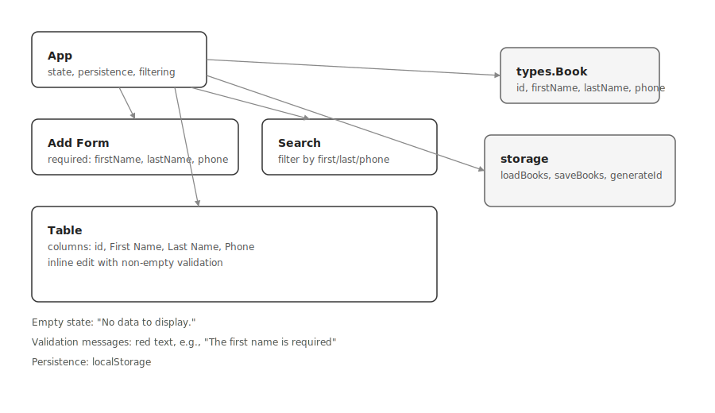

# Address Book

Requirements implemented:

- firstName, lastName, phone are required on add with messages like "The first name is required"
- table shows id, First Name, Last Name, Phone
- search by first/last/phone
- inline row editing with non-empty validation
- empty state: "No data to display."

Data persistence: localStorage.

Schema:


```
docs/address-book.drawio
```

Patterns used for table rendering:

- Container-presentational split inside `App` for state and rendering
- Controlled inputs for form, search, and edit fields
- Derived state via memoization for filtered list

Scripts:

- dev: `npm run dev`
- build: `npm run build`
- preview: `npm run preview`
- vercel: uses `vercel.json` and `npm run vercel-build`
