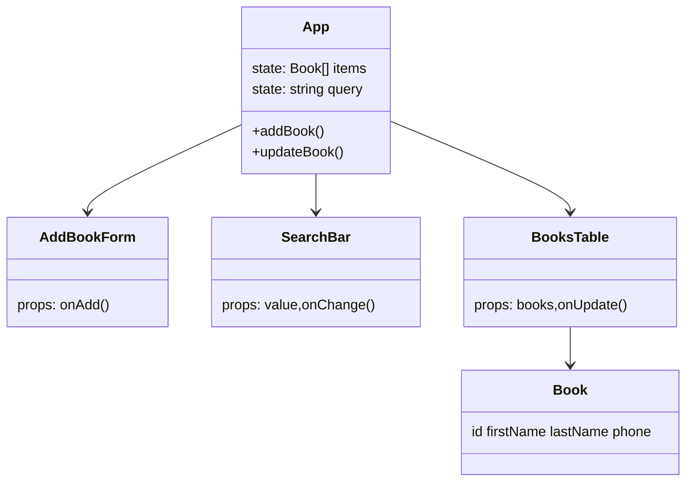

# Address Book

Minimal React + TypeScript address book with inline editing, validation, search and local persistence.

## Features
- Add contact (required: first name, last name, phone) with messages:
  - The first name is required
  - The last name is required
  - The phone is required
- Inline row editing (cannot save empty fields)
- Search (first / last / phone, case-insensitive)
- Empty state: `No data to display.`
- Data persisted in `localStorage`
- Stable generated `id` values

## Data Model
```
Book {
  id: string
  firstName: string
  lastName: string
  phone: string
}
```

## Architecture (overview)


## Table Rendering Patterns
- Keyed List Rendering: each row uses `book.id` as a stable React key (efficient diff).
- Inline Editing Pattern: a row switches between static text and controlled `<input>` fields when editing.
- Controlled Inputs: edit fields’ values bound to state (`editDraft`) for predictable updates & validation.
- Conditional Empty State: if filtered list length is zero, render a single full-width row / message.
- Derived Filtered View: search query produces `filtered` array via memoization (pure derivation, no duplication of data).
- Single Source of Truth: only `App` holds the master `items` array; table receives a slice via props.
- Immutability Update Pattern: row updates done with `map` returning new array (no in-place mutation), enabling React change detection.
- Separation of Concerns: form, search, and table isolated so table only handles display/edit logic.
- Validation Before Commit: edit cannot “Save” if any required field empty (prevents invalid row state).
- Semantic Role Preservation: still a native `<table>` for accessibility instead of purely div layout.

## General Patterns
- Lifting State Up
- Persistence (localStorage)
- Early Return on validation failure
- Reusable validation function (pure)
- Clear error messaging per field

## Scripts
| Command | Purpose |
| ------- | ------- |
| `npm run dev` | Dev server |
| `npm run build` | Production build (`vite build`) |
| `npm run preview` | Preview built assets |
| `npm run lint` | ESLint check |
| `npm run lint:fix` | ESLint auto-fix |
| `npm run format` | Prettier format |
| `npm run format:check` | Prettier check |

## Deployment Notes
- Built with Vite — output directory is `dist`.
- On Vercel: either omit `vercel.json` (auto-detect) or use a minimal config (see below).